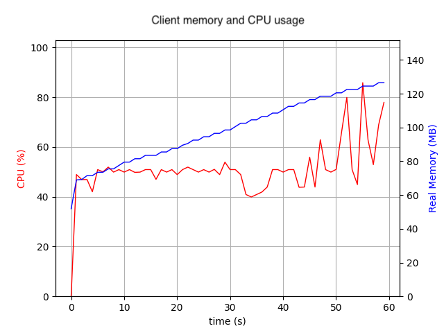
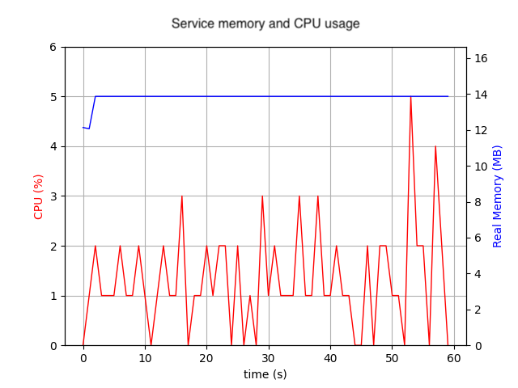

## rclpy_822

`rclpy` issue 822:
Memory leak in client when using python wrapper to send request to service.




---

To reproduce these charts, please install `psrecord`, `matplotlib`, and `tkinter`, and then run `memory.sh`.

```bash
pip3 install psrecord matplotlib
sudo apt-get install python3-tkinter
```
